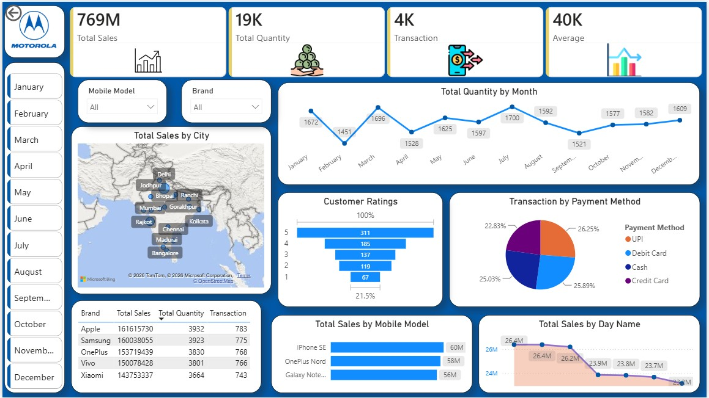

# 📱 Mobile Sales Dashboard | Power BI

## 📌 Overview

This Power BI dashboard provides an interactive analysis of Mobile Sales data. It helps track sales performance, customer behavior, and business trends using dynamic visualizations and KPIs.

---

## 📸 Dashboard Preview



---

## 🚀 Features

- Monthly Sales Analysis
- City-wise Sales Map
- Brand-wise Performance
- Mobile Model Sales
- Customer Ratings
- Payment Method Analysis
- Interactive Filters (Month, Brand & Mobile Model)

---

## 🛠 Tools Used

- Microsoft Power BI
- Power Query
- DAX
- Excel

---

## 📂 Project Structure

```
Mobile-Sales-Dashboard-PowerBI/
│
├── Dashboard/
│   └── Mobile Sales Dashboard.pbix
│
├── Dataset/
│   └── Mobile_Sales_Data.xlsx
│
├── Images/
│   └── dashboard.png
│
└── README.md
```

---

## 📈 Key Insights

- Identified top-performing mobile brands and models.
- Analyzed monthly sales trends.
- Compared city-wise sales performance.
- Evaluated customer ratings and payment preferences.
- Built an interactive dashboard for business decision-making.

---

## 👨‍💻 Author

**Abhishek Sharma**

🔗 LinkedIn: https://linkedin.com/in/abhishek-sharma-5b0498356

💻 GitHub: https://github.com/abhishek06092003
